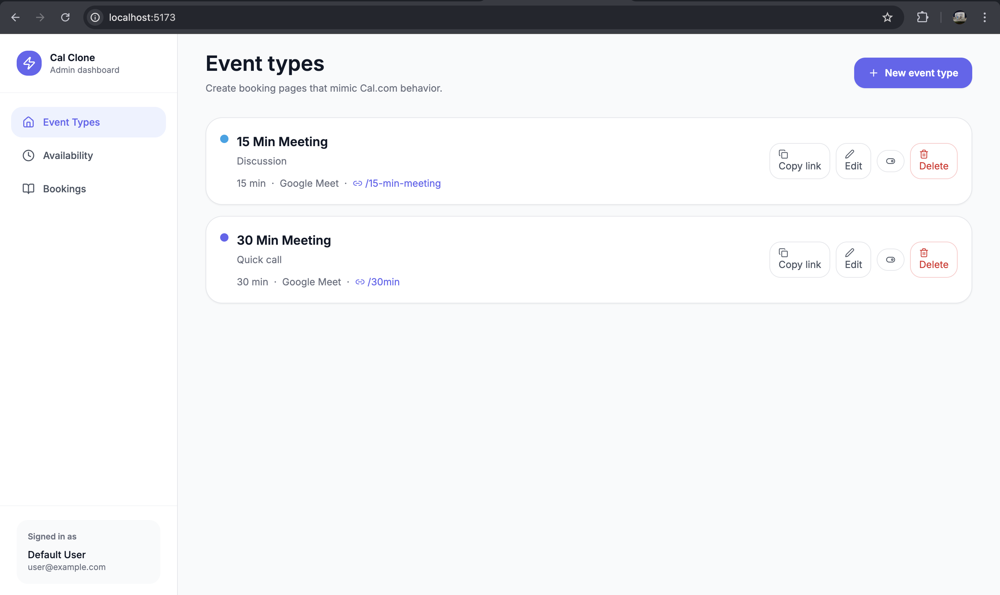
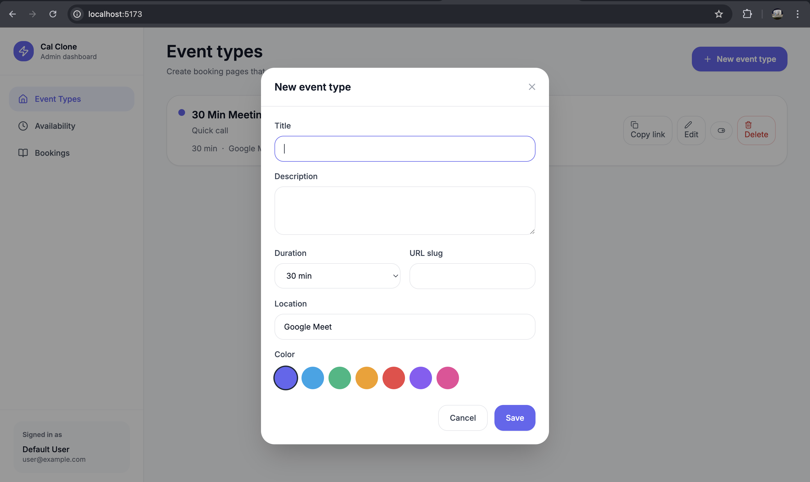
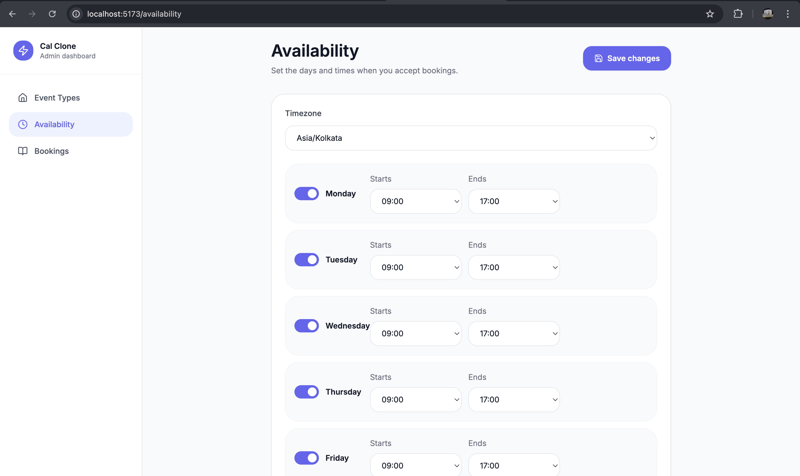
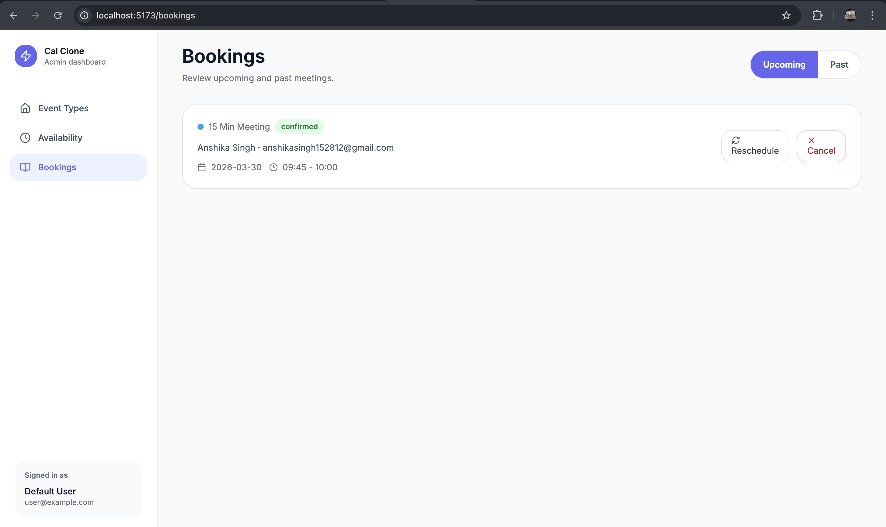
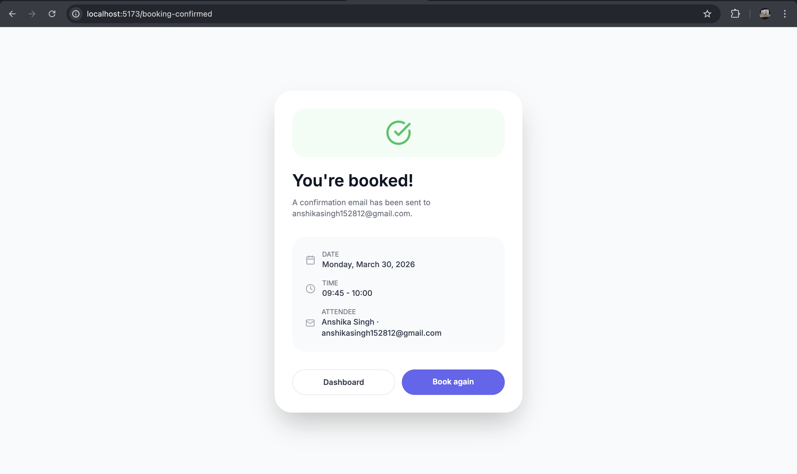
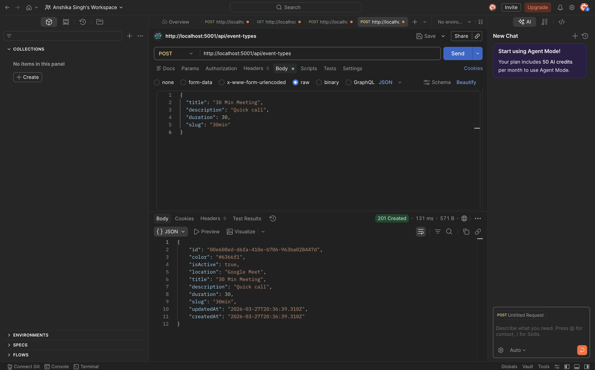

# 📅 Cal Clone – Scheduling Application

A full-stack scheduling and booking web app inspired by **Cal.com**.
Users can create event types, set availability, and allow others to book meetings seamlessly.

---

## 🔗 Live Repository

👉 https://github.com/Ansh1ka15/cal-clone

---

## ✨ Features

* 🗂️ Create, edit, delete event types
* ⏰ Set weekly availability
* 🔗 Unique booking link (slug-based)
* 📆 Public booking page
* 📝 Attendee enters name & email
* ✅ Booking confirmation screen
* 📊 View upcoming bookings
* 🔄 Cancel & reschedule bookings
* 🎨 Color-coded event types

---

## 📸 Screenshots

### 📌 Event Types Dashboard



### ➕ Create Event Type



### ⏰ Availability



### 📊 Bookings



### ✅ Booking Confirmation



### 🔌 API Testing



---

## 🛠️ Tech Stack

### Frontend

* React (Vite)
* Tailwind CSS
* Axios

### Backend

* Node.js
* Express.js
* Sequelize ORM

### Database

* PostgreSQL

---

## ⚙️ Setup Instructions

### Clone repo

```bash
git clone https://github.com/Ansh1ka15/cal-clone.git
cd cal-clone
```

---

### Backend Setup

```bash
cd backend
npm install
```

Create `.env`:

```
PORT=5000
DB_HOST=localhost
DB_PORT=5432
DB_NAME=calclone
DB_USER=postgres
DB_PASSWORD=yourpassword
```

Run backend:

```bash
npm run dev
```

---

### Frontend Setup

```bash
cd frontend
npm install
```

Create `.env`:

```
VITE_API_URL=http://localhost:5000/api
```

Run frontend:

```bash
npm run dev
```

---

## 🌐 API Endpoints

### Event Types

* GET `/api/event-types`
* POST `/api/event-types`
* PUT `/api/event-types/:id`
* DELETE `/api/event-types/:id`

### Availability

* GET `/api/availability`
* PUT `/api/availability`

### Bookings

* GET `/api/bookings`
* POST `/api/bookings`
* PATCH `/api/bookings/:id/cancel`
* PATCH `/api/bookings/:id/reschedule`

---

## 📌 Note

This project uses a **dummy logged-in user**.
No authentication (JWT/OAuth) is implemented as it's not required for core functionality.

---

## 🚀 Future Improvements

* 🔐 Add authentication (JWT / OAuth)
* 📅 Google Calendar integration
* 🌍 Timezone handling improvements
* 📩 Real email notifications

---

## 👩‍💻 Author

**Anshika Singh**


